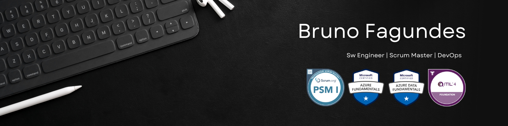

## About Me
🚀 I specialize in streamlining workflows, leading Agile transformations, and building DevOps and automation solutions that scale.  
🧠 I bridge the gap between software engineering, IT operations, cloud infrastructure, and Agile methodologies.  
🌐 Experienced in modern IT ecosystems with expertise in Azure, Intune, ServiceNow, Jira, Python and more.  
📊 Focused on driving operational efficiency, service reliability, and user experience improvements.  

## Tech Stach
### Dev and Scripting

### Python libs

### Web Dev

### Cloud and Infrastucture

### Agile and ITSM

## GitHub Analytics

  
  

## How to reach me

